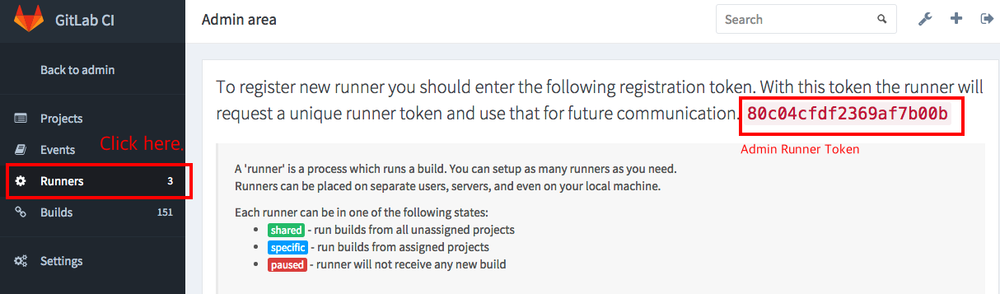
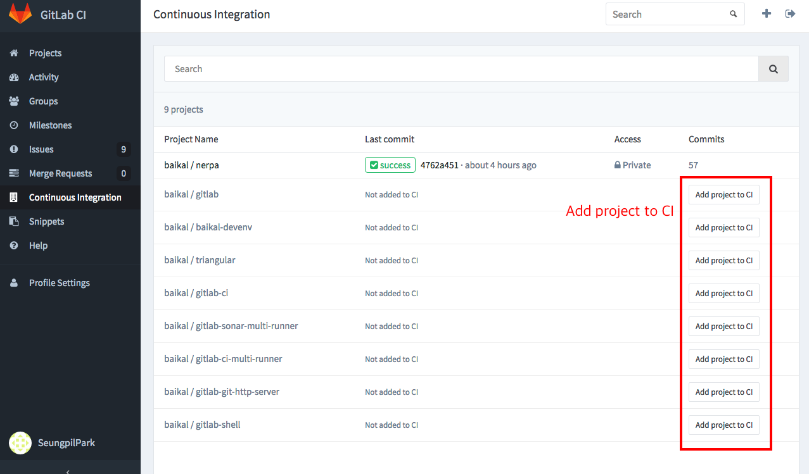
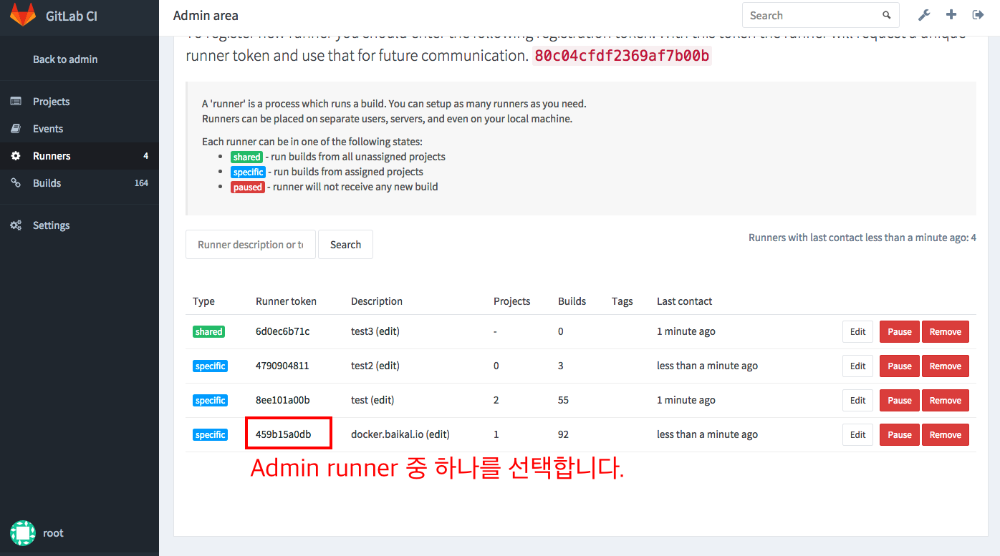
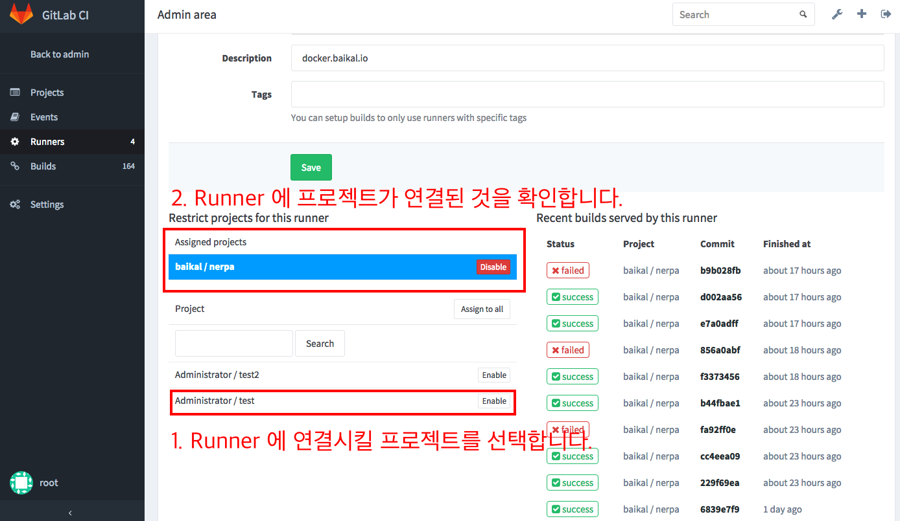
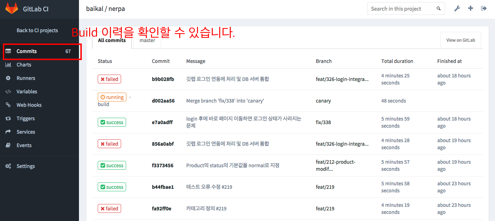
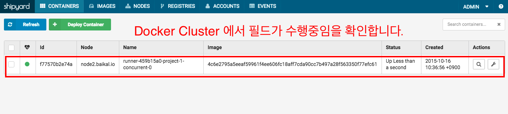

# 서버 운용법과 개발설명서

본 문서는 docker를 기반으로 하는 CI 플랫폼을 일반 서버 또는 VM에 구축하고 운용하기 위한 가이드입니다. 
본 문서는 Gitlab, Docker Cluster 및 Sonarqube 설치와 구성에 대한 내용을 포함하고 있습니다.

# 운용
본 문서의 목표는 서버 운용자로 하여금 Gitlab 프로젝트의 빌드와 코드분석 실행시 Docker Cluster 를 활용하여 유저의 프로젝트마다 독립적인 OS 빌드환경과 소스코드 분석 서비스를 제공하고, 소모되는 리소스를 Docker Cluster 환경에 분산배치 하는 것입니다.

이를 구축하기 위해서 다음의 순서로 설치를 진행하시기 바랍니다.
본 문서와 관련하여 참고할 수 있는 리소스는 다음과 같습니다.
 * [Docker](https://www.docker.com/)
 * [Docker shipyard](https://shipyard-project.com/)
 * [Gitlab](https://about.gitlab.com/)
 * [Sonarqube](http://www.sonarqube.org/)
 * [Amazon EC2](https://aws.amazon.com/ko/ec2/)

### 목차

[Docker Cluster 운용](#docker-cluster-운용)

 - [Docker Image](#docker-image)
    - [Dockerfile 작성](#dockerfile-작성)
    - [Registry 서버 저장](#registry-서버-저장)
    - [Agent 서버 배포](#agent-서버-배포)

 - [Docker Agent](#docker-agent)
    - [Docker Agent Server Install](#docker-agent-server-install)
    - [Add Agent to Manager Server](#add-agent-to-manager-server)
    - [Remove Agent to Manager Server](#remove-agent-to-manager-server)
    
[Gitlab CI 빌드 수행](#gitlab-ci-빌드-수행)

 - [Runner 등록](#runner-등록)
    - [CI Runner Token](#ci-runner-token)
    - [Registe Runner](#registe-runner)
    - [Runner Config Detail](#runner-config-detail)
    
 - [Run Ci build](#run-ci-build)
    
    - [Create CI Project](#create-ci-project)
    - [Link CI Project to Runner](#link-ci-project-to-runner)
    - [Add yml file to project](#add-yml-file-to-project)
    - [Test CI build](#test-ci-build)
    
 - [Run Sonar build](#run-sonar-build)
    
    - [Prepare Sonar Runner Image](#prepare-sonar-runner-image)
    - [gitlab-sonar-multi-runner daemon](#gitlab-sonar-multi-runner-daemon)
        - [Configration](#configration)
        - [Prepare Database](#prepare-database)
        - [Run daemon](#run-daemon)
        - [list commands](#list-commands)
        - [Run SonarQube Analytics](#run-sonarqube-analytics)
        - [Get Analytics Status](#get-analytics-status)
        - [Get Analytics Logs](#get-analytics-logs)
        - [Intergrate CI build](#intergrate-ci-build)
    

## Docker Cluster 운용

### Docker Image
도커 이미지를 생성하는 것은 CI 플랫폼을 운영하기 위한 가장 첫 단계입니다.
앞서 [설치메뉴얼](install.md) 을 모두 무사히 마치셨다면, 도커 클러스터가 생성되어있고, shipyard ui 에 접속할 수 있을 것입니다.

본 문서의 튜토리얼을 진행하기 위해서 Docker Image 에 관한 기본적인 학습을 마치시길 바랍니다.
Docker Image 기본 학습 리소스는 다음과 같습니다.
 - [Get started with images](https://docs.docker.com/userguide/dockerimages/)

이 단계에서는 gitlab ci build 수행에 필요한 도커 이미지를 Dockerfile 을 사용하여 생성하고,
생성된 이미지를 Agent Server 들에 배포하는 방법까지 다뤄봅니다.

#### Dockerfile 작성 

Docker Manager Server에서 실행합니다.

```sh
$ cd
$ sudo mkdir nodejs
$ cd nodejs

$ vi Dockerfile

# baikal-nodejs
#
# VERSION               0.0.1

FROM ubuntu:14.04
MAINTAINER Seungpil Park <seungpil.park@lecle.co.kr>

RUN apt-get update && apt-get install -y \
	curl \
	git  \
	build-essential  \
	python	\
	ruby

RUN gem install sass

RUN useradd -k /etc/skel -m -s /bin/bash nerpa
RUN chmod u+w /etc/sudoers && \
	echo "nerpa ALL=(ALL) NOPASSWD: ALL" >> /etc/sudoers && \
	chmod u-w /etc/sudoers

RUN curl -sL https://deb.nodesource.com/setup_0.12 | sudo bash -
RUN sudo apt-get install -y nodejs
RUN npm install -g bower grunt-cli jshint

CMD ["su","-","nerpa"]
```

위의 작성한 Dockerfile 은 ubuntu 14.04 운영체제에 nodejs 를 인스톨한 이미지를 생성하기 위한 메타파일입니다.
Dockerfile 작성을 위한 더 자세한 리소스는 [Dockerfile reference](https://docs.docker.com/reference/builder/) 를 참조하시길 바랍니다.

생성한 Dockerfile 을 이미지로 만들어 보겠습니다.

```sh
Dockerfile 이 들어있는 디렉토리 위치에서

$ sudo docker build -t nodejs ./

Step 0 : FROM ubuntu:14.04
 ---> 91e54dfb1179
Step 1 : MAINTAINER Seungpil Park <seungpil.park@lecle.co.kr>
 ---> Using cache
 ---> 31f837c25ba3
.
.
Successfully built 4c6e2795a5ee
```

다음 명령어로 이미지가 생성된 것을 확인해봅니다
```sh
$ sudo docker images
REPOSITORY TAG IMAGE ID CREATED VIRTUAL SIZE
.
.
nodejs latest 4c6e2795a5ee 12 days ago 498.2 MB
.
.
```

#### Registry 서버 저장
만들어진 도커 이미지를 Registry 서버에 저장합니다.
이 단계는 모든 Agent 서버로 이미지를 배포하기 위해 필요한 단계입니다.

```sh
<Registry server:port>/<이미지 이름> 형식으로 이미지를 변환합니다.

예제 : 
$ sudo docker tag nodejs 172.31.21.144:5000/nodejs

변환한 이미지를 registry 서버에 저장합니다.
$ sudo docker push 172.31.21.144:5000/nodejs

The push refers to a repository [172.31.21.144:5000/nodejs] (len: 1)
4c6e2795a5ee: Image already exists 
.
.
latest: digest: sha256:af1d350a340faca0a045f91995ea57d08cd3e604adf9735985e4330ee68262c2 size: 24395
```

#### Agent 서버 배포

Docker manager 서버가 관리하는 모든 Agent 서버로 nodejs 이미지를 배포합니다.
```sh
-H tcp://<Docker manager server>:port 옵션을 통해 매니저 서버에 명령을 내릴 수 있습니다.

예제:
$ sudo docker -H tcp://172.31.26.45:3375 pull 172.31.21.144:5000/nodejs

Using default tag: latest
node1.baikal.io: Pulling 172.31.21.144:5000/nodejs:latest... : downloaded 
node2.baikal.io: Pulling 172.31.21.144:5000/nodejs:latest... : downloaded 
node3.baikal.io: Pulling 172.31.21.144:5000/nodejs:latest... : downloaded 

```

### Docker Agent

Agent 는 실제로 ci 빌드와 소스코드 분석을 수행하는 워커 인스턴스입니다. CI 플랫폼 운영시 시스템 자원의 부족으로 어려움을 겪게 된다면 Agent 를 늘리는 것이 좋습니다.
다음의 순서대로 시스템의 중단 없이 Agent 를 확충할 수 있습니다.

#### Docker Agent Server Install

에이전트 서버를 하나 생성합니다.
- [Docker Agent Server Install](install.md#docker-agent-server-install)

#### Add Agent to Manager Server
매니저 서버의 콘솔에서 다음 명령어를 수행합니다.
```sh
$ sudo docker run \
    -ti \
    -d \
    --restart=always \
    --name baikal-swarm-agent<N> \
    swarm:latest \
    join --addr <new agent server>:port consul://<consul server>:port

예제:
$ sudo docker run \
    -ti \
    -d \
    --restart=always \
    --name baikal-swarm-agent7 \
    swarm:latest \
    join --addr 172.31.20.53:2375 consul://172.31.26.45:8500

```

shipyard ui 의 NODES 탭을 통해 새로운 Agent가 등록된 것을 확인하거나, 커맨드 라인을 통해서도 확인할 수 있습니다.

```sh

$ sudo docker -H tcp://<manager server>:3375 info

Containers: 0
Images: 10
Role: primary
Strategy: spread
Filters: affinity, health, constraint, port, dependency
Nodes: 3
 node1.baikal.io: 172.31.20.53:2375
  └ Containers: 0
  └ Reserved CPUs: 0 / 2
  └ Reserved Memory: 0 B / 4.052 GiB
  └ Labels: executiondriver=native-0.2, kernelversion=3.13.0-65-generic, operatingsystem=Ubuntu 14.04.2 LTS, storagedriver=aufs
 node2.baikal.io: 172.31.19.132:2375
  └ Containers: 0
  └ Reserved CPUs: 0 / 2
  └ Reserved Memory: 0 B / 4.052 GiB
  └ Labels: executiondriver=native-0.2, kernelversion=3.13.0-48-generic, operatingsystem=Ubuntu 14.04.2 LTS, storagedriver=aufs
 node3.baikal.io: 172.31.26.7:2375
  └ Containers: 0
  └ Reserved CPUs: 0 / 2
  └ Reserved Memory: 0 B / 4.052 GiB
  └ Labels: executiondriver=native-0.2, kernelversion=3.13.0-65-generic, operatingsystem=Ubuntu 14.04.2 LTS, storagedriver=aufs
CPUs: 6
Total Memory: 12.16 GiB
Name: 69ed2db46ef4

```

#### Remove Agent to Manager Server

반대로 필요없어진 Agent 를 manager 서버로부터 삭제하는 방법입니다.
Docker container 에 대한 기본적인 사항을 학습하시는 것이 도움이 될 것입니다.
 - [Get started with containers](https://docs.docker.com/articles/basics/)
 
매니저 서버의 콘솔에서 다음 명령어를 입력합니다.
```sh
$ sudo docker ps
CONTAINER ID IMAGE COMMAND CREATED STATUS PORTS NAMES
.
.
eb4844b872ea swarm:latest "/swarm join --addr 1" 44 hours ago Up 44 hours 2375/tcp                                                                                      baikal-swarm-agent7
```

컨테이너의 이름이 baikal-swarm-agent7 인 agent 를 삭제하여 봅니다.


```sh
$ sudo docker stop baikal-swarm-agent7
$ sudo docker rm baikal-swarm-agent7
```

컨테이너를 삭제한 후에, 실제 Agent 노드의 콘솔로 이동한 후 docker daemon 을 중지시켜야 합니다.

```sh
Agent 7번 인스턴스로 이동 후..

docker 서비스를 중단합니다.
$ sudo service docker stop

http 데몬을 중지합니다.
$ sudo ps -ef | grep docker
.
root     12994 12993  0 07:56 pts/0    00:00:00 docker daemon -H=tcp://0.0.0.0:2375 --insecure-registry 172.31.21.144:5000
.
.
-H 옵션으로 돌아가고 있는 docker daemon 을 중지합니다.
$ sudo kill 12994

```

shipyard ui 나 docker info 명령어를 통해 agent 가 삭제된 것을 확인하도록 합니다.

```sh
$ sudo docker -H tcp://<manager server>:3375 info

```


## Gitlab CI 빌드 수행

앞서 [Docker Cluster 운용](#docker-cluster-운용) 을 숙지하셨다면,  
실제 Gitlab CI 빌드를 Docker Cluster 상에서 수행해 보도록 합니다.

### Runner 등록

Gitlab Server 와  Runner 서버의 gitlab-ci-multi-runner 는 토큰값을 통해 CI build 를 수행합니다.
다음 절차를 통해 gitlab-ci-multi-runner 에 토큰을 등록하고, 어떤 도커를 이미지를 지정할 것인지 알아봅니다.
이 과정은 서비스의 운용중에 엔드유저의 요구에 따라 다양한 도커 이미지를 준비하고, 준비한 도커 이미지를 Gitlab 서버에 등록하는 절차로써,
서버 운용자의 꾸준한 관리가 필요합니다.
이 과정은 자동화 하기 위한 준비단계에 있으며, 현재로서는 수작업으로 진행해야 합니다.

#### CI Runner Token

Gitlab 사이트에 어드민 계정으로 로그인 후, 우측 상단의 admin area 버튼을 통해 관리자 화면에 들어갑니다.
좌측 Continuous Integration 메뉴를 클릭합니다.



Runner 탭을 클릭하시면 admin-runner-token 을 확인할 수 있습니다.

#### Registe Runner

이제, Runner Server 에서 다음 명령어를 수행합니다.
```sh
sudo gitlab-ci-multi-runner register

Please enter the gitlab-ci coordinator URL (e.g. https://gitlab.com/ci )
<your gitlab server/ci>
Please enter the gitlab-ci token for this runner
<admin-runner-token>
Please enter the gitlab-ci description for this runner
test-runner
INFO[0034] fcf5c619 Registering runner... succeeded
Please enter the executor: shell, docker, docker-ssh, ssh?
docker
Please enter the Docker image (eg. ruby:2.1):
<docker image name>
INFO[0037] Runner registered successfully. Feel free to start it, but if it's
running already the config should be automatically reloaded!


본 문서의 설정값에 따라 예제를 작성해보겠습니다.
예제 : 
Please enter the gitlab-ci coordinator URL (e.g. https://gitlab.com/ci )
http://git.baikal.io/ci
Please enter the gitlab-ci token for this runner
80c04cfdf2369af7b00b
Please enter the gitlab-ci description for this runner
test
INFO[0034] fcf5c619 Registering runner... succeeded
Please enter the executor: shell, docker, docker-ssh, ssh?
docker
Please enter the Docker image (eg. ruby:2.1):
172.31.21.144:5000/nodejs
INFO[0037] Runner registered successfully. Feel free to start it, but if it's
running already the config should be automatically reloaded!
```

위 절차를 마치면 [CI Runner Token](#ci-runner-token) 에서 들어갔던 웹페지에 test 러너가 등록되있는 것을 확인할 수 있습니다.

다시 Runner Server 에서 /etc/gitlab-runner/config.toml 파일을 엽니다.

```sh
$ sudo vi /etc/gitlab-runner/config.toml

concurrent = 4
[[runners]]
  name = "test"
  url = "http://git.baikal.io/ci"
  token = "6d0ec6b71c904d31db92574f69c497"
  limit = 1
  executor = "docker"
  [runners.docker]
    image = "172.31.21.144:5000/nodejs"
    privileged = false
    volumes = ["/cache"]
```

token 값이 달라졌지만, 정상적인 상황입니다.
이 파일을 다음과 같이 수정합니다.
```sh
concurrent = 4
[[runners]]
  name = "test"
  url = "http://ci.baikal.io/ci"
  token = "6d0ec6b71c904d31db92574f69c497"
  limit = 0
  executor = "docker"
  [runners.docker]
    host = "tcp://172.31.26.45:3375"
    image = "172.31.21.144:5000/nodejs"
    privileged = false
    disable_cache = true
    volumes = ["/cache"]
    allowed_images = ["*", "*/*", "*/*/*"]
    allowed_services = ["*", "*/*"]
```

#### Runner Config Detail

/etc/gitlab-runner/config.toml  파일에서 concurrent 항목을 볼 수 있습니다.
이것은 매우 중요한 옵션입니다.
이 옵션은 gitlab-ci-multi-runner 가 동시에 관리하는 docker container 의 max count 입니다.
이 옵션의 값보다 더 많은 CI build 요청이 올 경우 초과되는 요청들은 pending  상태에 놓여 있다가, 앞선 요청들이 처리되었을 때 running 상태로 들어 갈 것입니다.
운영중인 Docker Agent 수와 똑같이 마추는 것이 안정적입니다.

/etc/gitlab-runner/config.toml 에 대한 상세한 정보는 다음 리소스를 통해 찾아볼 수 있습니다.

[See advanced configuration options](https://gitlab.com/gitlab-org/gitlab-ci-multi-runner/blob/master/docs/configuration/advanced-configuration.md) 
[See example configuration file](https://gitlab.com/gitlab-org/gitlab-ci-multi-runner/blob/master/config.toml.example)
[See security considerations](https://gitlab.com/gitlab-org/gitlab-ci-multi-runner/blob/master/docs/security/index.md)

### Run Ci build
이 단계는 gitlab 프로젝트를 ci project 로 등록하고, ci build 가 프로젝트 commit 이 이루어질 때 자동으로 실행되는 과정을 다룹니다.
이 단계에서부터는 [Gitlab CI Api](http://doc.gitlab.com/ci/api/README.html)  가 제공되므로, 본 문서를 읽는 어플리케이션 개발자는 Api 를 통해 구현하는 것을 추천합니다.


#### Create CI Project

1) UI

깃랩 사이트에서 프로젝트 소유자로 로그인 한 뒤 /ci/projects 로 접속하시면, 프로젝트 목록을 볼 수 있습니다.
프로젝트의 Add project to CI 버튼을 클릭하면 해당 프로젝트는 CI Project 로 등록이 됩니다.



2) API

이 과정은 다음 API 로 처리할 수 있습니다.
 - [Create Project](http://doc.gitlab.com/ci/api/projects.html#create-project) 

#### Link CI Project to Runner

1) UI

깃랩 사이트에서 관리자로 로그인 하신 뒤 /ci/admin/projects 에 접속하시면, 등록된 Runner 목록을 볼 수 있습니다.

Runner 를 선택하여 넘어간 페이지에서 CI 프로젝트와 Runner 를 연결시킬 수 있습니다.
연결된 프로젝트는 Commit 이 이루어질 경우 연결된 Runner 를 통해 build 가 수행됩니다.
이 Runner 는 앞서 [Registe Runner](#registe-runner) 과정에서 등록되었던 docker image 를 통해 빌드를 수행 할 것입니다.





2) API

이 과정은 다음 API 로 처리할 수 있습니다.
 - [Link Project to Runner](http://doc.gitlab.com/ci/api/projects.html#link-project-to-runner) 


#### Add yml file to project

Gitlab CI build 가 정상적으로 수행되기 위해서는 .gitlab-ci.yml 파일이 프로젝트 root에 있어야 합니다.
.gitlab-ci.yml 파일은 빌드가 수행되는동안 처리할 스크립트 등의 정보를 기술해 놓는 파일입니다.
.gitlab-ci.yml 에 대한 작성법은 아래 리소스를 통해 숙지하십시오.

[Configuration of your builds with .gitlab-ci.yml](http://doc.gitlab.com/ci/yaml/README.html)

예제: nodejs를 설치하는 .gitlab-ci.yml
```sh
job1:
  script:
    - pwd
    - id
    - curl -sL https://deb.nodesource.com/setup_0.12 | bash -
    - sleep 11
    - apt-get install -y nodejs
```

현재로서는 서비스 이용자가 직접 .gitlab-ci.yml 파일 작성법을 숙지하고 프로젝트에 응용해야 합니다.
하지만 진입장벽이 높기 때문에, 이 또한 자동화 할 수 있는 방안을 다음 버전에 포함시켜야 합니다.

#### Test CI build

.gitlab-ci.yml 를 포함한 프로젝트를 commit 시켜봅니다.
Gitlab 사이트에서 /ci/projects/<프로젝트 아이디> 로 접속해봅니다.

아래 화면처럼 나온다면 모든 과정을 수행 한 것입니다.



Shipyard 에 접속해보면 빌드가 수행중일 때, Docker cluster 에서 빌드를 수행중인 컨테이너가 생기게 됩니다.




### Run Sonar build

SonarQube 를 통한 소스코드 분석은 CI Build 보다 간단하며,  서비스 이용자 입장에서 .gitlab-ci.yml 등의 특별한 진입장벽이 필요하지 않습니다.

하지만 초기 세팅과정이 다소 복잡하니 아래 절차를 잘 숙지하시기 바랍니다.

#### Prepare Sonar Runner Image

SonarQube Server 는 분석결과 데이터베이스와 UI만을 제공하고,
실질적으로 소스코드 분석을 수행하지는 않습니다.
실직적인 소스코드 분석은 Sonar-Runner 라는 프로그램이 수행하는데 이 작업은 프로젝트 규모가 클수록 매우 많은 리소스를 소모하게 됩니다.
따라서 Docker Cluster 환경에서 Sonar-Runner 가 소스코드 분석을 수행하고, 이 결과물을 SonarQube 서버로 전송하는 시스템을 구축하게 된다면 소모되는 리소스를 분산배치 할 수 있습니다.

제일 처음 할 일은 Sonar Runner 도커 이미지를 준비하는 것 입니다.
이 이미지는 Sonar Runner 가 설치되어있고, gitlab-sonar-multi-runner 로 부터 필요한 파라미터들을 전송받아 스스로 프로젝트를 다운로드 한 후 소스코드를 분석, Sonar Server 로 전송하는 스크립트를 포함합니다.

Runner Server 에서 아래 절차를 수행합니다.
```sh

우분투 14.04 도커 이미지를 부팅합니다.

$ sudo docker run -i -t --name sonar-runner ubuntu:14.04 /bin/bash


부팅한 이미지에 설치를 수행합니다.

root@a76daf1b3bdd:/# cd

root@a76daf1b3bdd:~# sudo apt-get install wget vim

root@a76daf1b3bdd:~# wget http://repo1.maven.org/maven2/org/codehaus/sonar/runner/sonar-runner-dist/2.4/sonar-runner-dist-2.4.zip

root@a76daf1b3bdd:~# sudo apt-get install unzip

root@a76daf1b3bdd:~# unzip sonar-runner-dist-2.4.zip

root@a76daf1b3bdd:~# mv sonar-runner-2.4/ /opt/

root@a76daf1b3bdd:~# vi runner.sh

#!/bin/bash

export PATH=$PATH:/opt/sonar-runner-2.4/bin

#echo "sonar.host.url: $1"
#echo "sonar.jdbc.username: $2"
#echo "sonar.jdbc.password: $3"
#echo "sonar.jdbc.url: $4"
#echo "sonar.login: $5"
#echo "sonar.password: $6"
#echo "sonar.projectKey: $7"
#echo "sonar.projectName: $8"
#echo "sonar.projectVersion: $9"
#echo "giturl: $10"
#echo "gituser: $11"
#echo "gitpass: $12"

sonarfile=/opt/sonar-runner-2.4/conf/sonar-runner.properties
rm -rf $sonarfile

echo "sonar.host.url=$1" >> $sonarfile
echo "sonar.jdbc.username=$2" >> $sonarfile
echo "sonar.jdbc.password=$3" >> $sonarfile
echo "sonar.jdbc.url=$4" >> $sonarfile
echo "sonar.login=$5" >> $sonarfile
echo "sonar.password=$6" >> $sonarfile

schema=http://
giturl=$10
endpoint=${giturl#$schema}

authurl=$schema''$11':'$12'@'$endpoint

projectdir="${authurl##*/}"
projectdir="${projectdir%.*}"
rm -rf $projectdir
git clone $authurl
cd $projectdir

runnerfile=sonar-project.properties
rm -rf $runnerfile

echo "sonar.projectKey=$7" >> $runnerfile
echo "sonar.projectName=$8" >> $runnerfile
echo "sonar.projectVersion=$9" >> $runnerfile
echo "sonar.sources=." >> $runnerfile
echo "sonar.sourceEncoding=UTF-8" >> $runnerfile

sonar-runner -e

root@a76daf1b3bdd:~# exit


수행한 과정을 sonar-runner 이미지로 생성합니다.
$ sudo docker commit sonar-runner sonar-runner


생성한 이미지를 Docker cluster에 배포합니다.

$ sudo docker tag sonar-runner <Registry Server>:5000/sonar-runner

$ sudo docker push <Registry Server>:5000/sonar-runner

$ sudo docker -H tcp://<Manager Server>:3375 pull <Registry Server>:5000/sonar-runner


생성한 이미지를 Docker cluster에 배포합니다 예제:

$ sudo docker tag sonar-runner 172.31.21.144:5000/sonar-runner

$ sudo docker push 172.31.21.144:5000/sonar-runner

$ sudo docker -H tcp://172.31.26.45:3375 pull 172.31.21.144:5000/sonar-runner
```


#### gitlab-sonar-multi-runner daemon


##### Configration
Runner Server 에서, gitlas-sonar-multi-runner 의 설정파일을 수정합니다.

```sh
gitlab-sonar-multi-runner 소스코드를 다운받은 디렉토리로 이동합니다.
$ cd <gitlab-sonar-multi-runner directory>
$ vi conf/config.json

예제 :
{
  "sonar.host.url": "http://sonar.baikal.io:9100",
  "sonar.jdbc.username": "sonar",
  "sonar.jdbc.password": "sonar",
  "sonar.jdbc.url": "jdbc:mysql://sonar.baikal.io:3306/sonar?useUnicode=true&characterEncoding=utf8&rewriteBatchedStatements=true&useConfigs=maxPerformance",
  "sonar.login": "admin",
  "sonar.password": "admin",
  "docker.tcp.host": "tcp://172.31.26.45:3375",
  "docker.http.host": "http://master.baikal.io",
  "docker.http.port": 3375,
  "docker.image": "172.31.21.144:5000/sonar-runner",
  "gitlab.user": "root",
  "gitlab.pass": "qkfka3000",
  "gitlab.url": "http://git.baikal.io",
  "gitlab.token": "Cvs--jaL5NyN7Z-A-bKQ",
  "gitlab.ci.url": "http://ci.baikal.io",
  "gitlab.ci.token": "80c04cfdf2369af7b00b",
  "gitlab.ci.dbname": "gitlabhq_production",
  "gitlab.ci.db.username": "git",
  "gitlab.ci.db.pass": "qkfka3000",
  "gitlab.ci.db.port": "5432",
  "gitlab.ci.db.host": "ci.baikal.io",
  "logdir": "/Users/lecle/IdeaProjects/gitlab-sonar-multi-runner/logs",
  "maxjob": 4,
  "jobInterval": 3000,
  "listen.port": 9010,
  "listen.host": "runner.baikal.io"
}

```

각 항목을 살펴보겠습니다.

 - sonar.host.url : SonarQube 웹 URL
 - sonar.jdbc.username : SonarQube 데이터베이스 사용자이름
 - sonar.jdbc.password : SonarQube 데이터베이스 패스워드
 - sonar.jdbc.url : jdbc:mysql://[Sonarqube 호스트]:3306/sonar?useUnicode=true&characterEncoding=utf8&rewriteBatchedStatements=true&useConfigs=maxPerformance
 - sonar.login : SonarQube admin 아이디
 - sonar.password : SonarQube admin 패스워드
 - docker.tcp.host : tcp://[Docer Manager host]:[Docer Manager port]
 - docker.http.host : http://[Docer Manager host]
 - docker.http.port : [Docer Manager port]
 - docker.image : [Sonar Runner Docker Image Name]
 - gitlab.user : Gitlab admin 아이디
 - gitlab.pass : Gitlab admin 패스워드
 - gitlab.url : Gitlab 웹 URL
 - gitlab.token : Gitlab admin token
 - gitlab.ci.url : Gitlab CI 웹 URL(omnibus package일 경우 gitlab.url 와 동일합니다.)
 - gitlab.ci.token : Gitlab admin runner token
 - gitlab.ci.dbname : Gitlab 데이터베이스 이름
 - gitlab.ci.db.username : Gitlab 데이터베이스 사용자이름
 - gitlab.ci.db.pass : Gitlab 데이터베이스 패스워드
 - gitlab.ci.db.port : Gitlab 데이터베이스 포트
 - gitlab.ci.db.host : Gitlab 데이터베이스 호스트
 - logdir : 로그디렉토리
 - maxjob : 최대 작업 수
 - jobInterval : 큐 딜레이
 - listen.port : 데몬 포트
 - listen.host : 데몬 호스트 


maxjob 항목은 문서 [Runner Config Detail](#runner-config-detail) 의 concurrent 옵션과 유사합니다.
이 수치 이상의 작업은 pending 상태로 들어가게 되며, Docker cluster 내에 여유 작업공간이 생길 경우 pending 상태의 소스코드 분석 작업이 수행됩니다.

Docker cluster 의 Agent  수 만큼 설정하는 것이  좋습니다.

config.json 의 수정 후 인스톨을 재실행합니다.
```sh
$ sudo npm install -g
```

##### Prepare Database
다음 명령어를 수행하면 gitlab-sonar-multi-runner 가 구동하기 위해 필요한 데이터베이스 테이블을 gitlab 데이터베이스에 생성하게 됩니다.
```sh
$ sudo gitlab-sonar-multi-runner initdb
```

Uninstall  시 테이블도 함께 삭제하기 위해서는 다음을 수행합니다.
```sh
$ sudo gitlab-sonar-multi-runner dropdb
```


##### Run daemon

데몬을 실행합니다.

```sh
$ sudo gitlab-sonar-multi-runner start
```

데몬을 중지하고자 하는 경우는
```sh
$ sudo gitlab-sonar-multi-runner stop
```

##### List Commands 

전체 명령어를 확인하고자 할 경우는
```sh
$ sudo gitlab-sonar-multi-runner

  Usage: gitlab-sonar-multi-runner [options] [command]
  Commands:

    setup [options] [env]              run setup commands for all envs
    exec [options] <cmd>               execute the given remote cmd
    run [options] <projectid>          run sonar-runner imediately from gitlab project.
    enablehook [options] <projectid>   enablehook will enable sonar-build automatically after a ci-build end.
    disablehook [options] <projectid>  disablehook will disable sonar-build automatically after a ci-build end.
    job [options] <jobid>              get job status
    cancle [options] <jobid>           cancle running job.
    logs [options] <jobid>             get logs of job
    initdb                             create ci_sonar_builds table in gitlab-ci database.
    dropdb                             drop ci_sonar_builds table in gitlab-ci database.
    start                              start gitlab-sonar-runner api and runner-Queue.
    stop                               stop gitlab-sonar-runner api and runner-Queue.

  Options:

    -h, --help           output usage information
    -V, --version        output the version number
    -C, --chdir <path>   change the working directory
    -c, --config <path>  set config path. defaults to ./deploy.conf
    -T, --no-tests       ignore test hook

```

##### Run SonarQube Analytics

```sh
$ sudo gitlab-sonar-multi-runner run <projectid>

예제:
$ sudo gitlab-sonar-multi-runner run 12

inserted new ci-sonar-builds record.
This jobid is equal ci_sonar_builds table`s primary key in gitlab-ci database
You can request status and logs using jobid. See README.md how to request.
jobid : 170
```

Rest Api :
```sh
$ sudo curl -H "Content-Type: application/json" -X POST -d '{"projectid": 12}' http://localhost:9010/api/run

Return:
{"jobid":170}
```

Cli 또는 Rest Api 로 run 명령을 실행하게 되면 jobid 를 리턴합니다.
jobid 를 사용해서 소스분석 작업의 진행상태와 로그를 가져올 수 있습니다.


##### Get Analytics Status

```sh
$ sudo gitlab-sonar-multi-runner job <projectid>

예제:
$ sudo gitlab-sonar-multi-runner run 170

job status : success
```

Rest Api :
```sh
$ curl -H "Content-Type: application/json" -X POST -d '{"jobid": 170}' http://localhost:9010/api/job

Return:
{"status":"success"}
```

##### Get Analytics Logs

```sh
$ sudo gitlab-sonar-multi-runner logs <projectid>

예제:
$ sudo gitlab-sonar-multi-runner logs 170
{
	 command : <Docker 실행 커맨드>,
	 log     : <소스코드 분석 실행 로그>,
	 error   : <소스코드 분석 에러 로그>
}

```

Rest Api :
```sh
$ curl -H "Content-Type: application/json" -X POST -d '{"jobid": 170}' http://localhost:9010/api/logs

Return:
{
	 command : <Docker 실행 커맨드>,
	 log     : <소스코드 분석 실행 로그>,
	 error   : <소스코드 분석 에러 로그>
}
```

##### Intergrate CI build
CI build 후 자동으로 소스코드 분석이 실행되게 하기 위해서는 다음을 수행하세요.

```sh
$ sudo gitlab-sonar-multi-runner enablehook <projectid>

예제:
$ sudo gitlab-sonar-multi-runner enablehook 12

enablehook successed.
```

Rest Api :
```sh
$ sudo curl -H "Content-Type: application/json" -X POST -d '{"projectid": 12}' http://localhost:9010/api/enablehook

Return:
"enablehook successed"
```

빌드수행 후 자동 소스코드 분석을 취소하기 위해서는 다음을 수행합니다.

```sh
$ sudo gitlab-sonar-multi-runner disablehook <projectid>

예제:
$ sudo gitlab-sonar-multi-runner disablehook 12

disablehook successed.
```

Rest Api :
```sh
$ sudo curl -H "Content-Type: application/json" -X POST -d '{"projectid": 12}' http://localhost:9010/api/disablehook

Return:
"disablehook successed."
```

